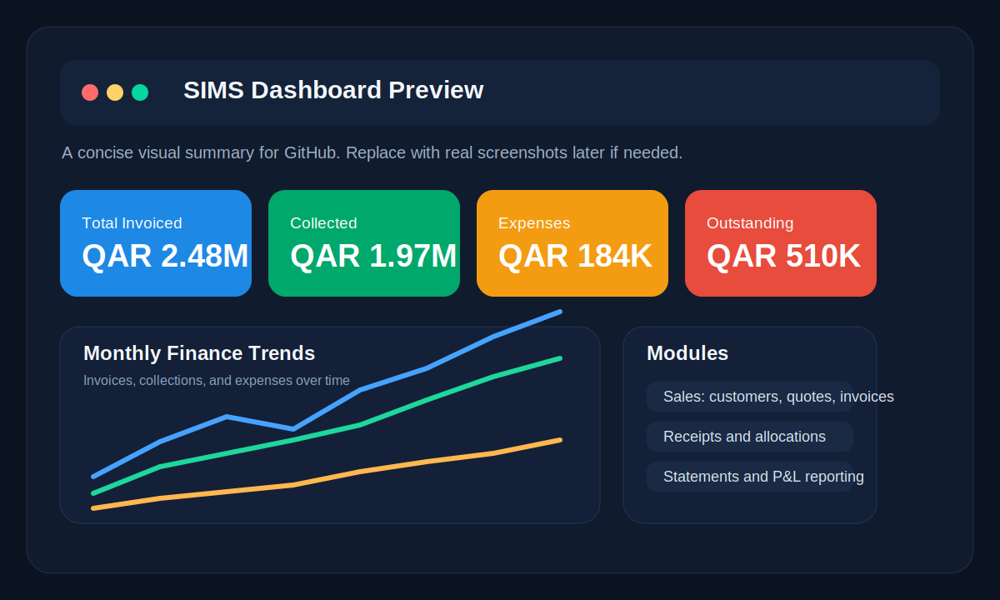
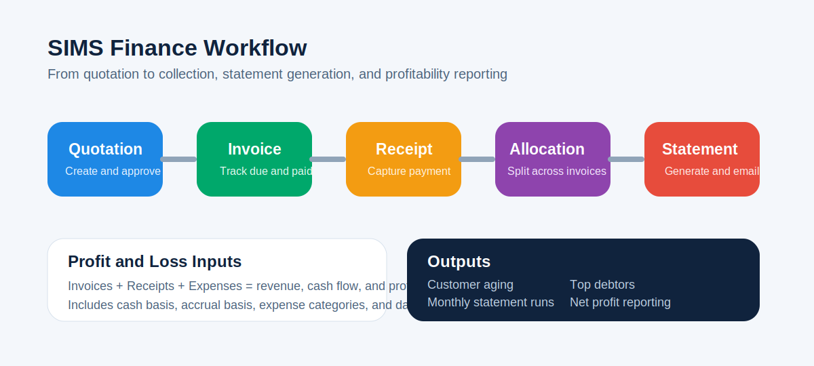

# SIMS


Sales & Invoice Management System for quotation-to-cash workflows, customer statements, receipt allocation, expense tracking, and profit reporting.

## Visual Preview





These repository preview graphics are included now so the project has immediate visuals on GitHub. They can be replaced later with real product screenshots or recorded GIFs from the running application.

## Overview

SIMS is a Django-based business application for small and medium teams that need to manage the full sales and collections lifecycle in one place.

It supports:

- quotations and quotation conversion
- invoice creation and PDF export
- receipts and multi-invoice payment allocation
- customer statements with aging analysis
- expense tracking and category reporting
- profit and loss style reporting on cash and accrual basis
- Arabic-friendly PDF rendering for regional business workflows

The current codebase uses SQLite by default for development and can be deployed behind Gunicorn and Nginx in production.

## Core Capabilities

### Sales Operations

- Customer management with contact details and history
- Quotation management with status workflow and validity dates
- Invoice management with taxes, discounts, line items, due dates, and payment status
- Receipt management with payment method tracking and printable documents

### Finance Operations

- Full payment allocation so one receipt can settle multiple invoices
- Customer statement generation with running balance and transaction ledger
- Monthly statement runs for all customers or one selected customer
- Statement email-status tracking with recipient and timestamp capture
- Expense recording by category, vendor, payment method, and reference number
- Profit and loss style reporting using invoices, receipts, and expenses

### Reporting and Visibility

- Finance dashboard with KPI cards and monthly trends
- Outstanding receivables monitoring
- Aging buckets for open invoices
- Top customers by outstanding balance
- Revenue comparison by invoiced value versus collected cash
- Expense breakdown by category across a selected date range

## Feature Highlights

### Multi-Invoice Payment Allocation

Receipts are no longer limited to a single invoice settlement model. A single payment can be distributed across several invoices for the same customer, while invoice paid amounts remain synchronized through the finance service layer.

### Customer Statements

Statements include:

- opening balance
- period debits and credits
- running balance per transaction
- outstanding invoice listing
- aging summary for overdue balances
- PDF export for sharing or archive purposes

### Profit and Loss Reporting

The finance module provides a practical operating view of business performance:

- invoiced revenue
- collected revenue
- total expenses
- net profit on cash basis
- net profit on accrual basis
- category-based expense analysis

## Tech Stack

| Layer | Technology |
| --- | --- |
| Backend | Django 5.2 |
| UI | Django Templates, Bootstrap 5, JavaScript |
| Forms | django-crispy-forms, crispy-bootstrap5 |
| Database | SQLite by default |
| PDF Rendering | WeasyPrint, ReportLab |
| App Server | Gunicorn |
| Test Data | Faker |

## Project Structure

```text
.
├── docs/
├── finance/
├── invsys/
├── sales/
├── templates/
├── manage.py
├── gunicorn_config.py
└── requirements.txt
```

### Main Apps

- `sales`: customers, quotations, invoices, receipts, analytics, PDFs
- `finance`: expenses, payment allocations, statements, statement runs, P&L reporting
- `invsys`: project settings, URL routing, WSGI and ASGI entry points

## Quick Start

### 1. Clone the Repository

```bash
git clone https://github.com/essyem/sims.git
cd sims
```

### 2. Create and Activate a Virtual Environment

```bash
python3 -m venv env
source env/bin/activate
```

### 3. Install Python Dependencies

```bash
pip install --upgrade pip setuptools wheel
pip install -r requirements.txt
```

### 4. Install System Dependencies for PDF Rendering

On Ubuntu 22.04 or 24.04:

```bash
sudo apt update
sudo apt install -y \
    python3-dev build-essential shared-mime-info fontconfig \
    libpango-1.0-0 libpangocairo-1.0-0 libpangoft2-1.0-0 \
    libgdk-pixbuf2.0-0 libffi-dev libcairo2 libcairo2-dev \
    libharfbuzz-dev libharfbuzz0b libjpeg-dev libpng-dev \
    fonts-arabeyes fonts-farsiweb fonts-kacst fonts-noto \
    fonts-noto-core fonts-noto-ui-core fonts-dejavu-core fonts-liberation
```

These packages are required for WeasyPrint and reliable Arabic PDF output.

### 5. Prepare Local Directories

```bash
mkdir -p media static staticfiles tmp logs
```

### 6. Run Database Migrations

```bash
python manage.py migrate
```

### 7. Create an Admin User

```bash
python manage.py createsuperuser
```

### 8. Start the Development Server

```bash
python manage.py runserver
```

Open `http://127.0.0.1:8000/` in your browser.

## Sample Data and Demo Workflows

### Seed Core Sales Data

```bash
python manage.py populate_test_data --clear --customers 100 --quotations 1000 --invoices 750
```

### Seed Finance Data

```bash
python manage.py seed_finance_data --sample-expenses 120 --with-allocations --with-statement-runs
```

### Generate Monthly Statements

```bash
python manage.py generate_monthly_statements
```

Optional targeted run:

```bash
python manage.py generate_monthly_statements --year 2026 --month 3 --customer-id 12
```

## Main User Flows

### Sales Flow

1. Create a customer.
2. Create a quotation with line items.
3. Convert the quotation to an invoice.
4. Record a receipt when payment arrives.
5. Print or export invoice and receipt PDFs.

### Finance Flow

1. Open a receipt.
2. Allocate payment across one or more invoices.
3. Review customer balances in the statement view.
4. Generate statement runs for the month.
5. Mark statements as emailed after dispatch.
6. Review profit and loss using the finance dashboard and P&L page.

## Application Areas

### Sales Module

- customer CRUD
- quotation CRUD
- invoice CRUD
- receipt CRUD
- invoice and quotation PDF output
- analytics pages for operating visibility

### Finance Module

- expense CRUD
- expense categories
- payment allocation management
- customer statement HTML and PDF views
- statement run generation and status tracking
- profit and loss reporting

## Tests

Run the finance test suite:

```bash
python manage.py test finance -v 2
```

Run all Django checks:

```bash
python manage.py check
```

## Configuration Notes

Current default behavior in the repository:

- SQLite is used as the default database.
- `DEBUG` is enabled for development.
- static files use `static/` and `staticfiles/` paths.
- login is required for most application views.

For production, update at minimum:

- `SECRET_KEY`
- `DEBUG = False`
- `ALLOWED_HOSTS`
- `CSRF_TRUSTED_ORIGINS`
- database configuration if moving away from SQLite

## Deployment

A more detailed server guide is available in `docs/deployguide.md`.

Typical production stack:

- Ubuntu Linux
- Gunicorn
- Nginx
- system package dependencies for WeasyPrint
- SSL termination with Let's Encrypt

## Included Management Commands

### Sales

- `populate_test_data`: generate customers, quotations, invoices, receipts, and item data
- `receivables_report`: reporting helper for receivables analysis

### Finance

- `seed_finance_data`: generate expenses, allocations, and statement runs
- `generate_monthly_statements`: create statement-run records for a selected month

## Intended Use Cases

SIMS is suitable for:

- service businesses
- consultancies
- agencies
- contractors
- trading companies
- SMEs handling bilingual invoice workflows

## Notes on Branding and Naming

The codebase still contains internal Django module names such as `invsys`, while the repository and product can be presented as `SIMS`. That naming difference does not affect runtime behavior.

## License

No license file is currently included in this repository. Add one before public distribution if needed.